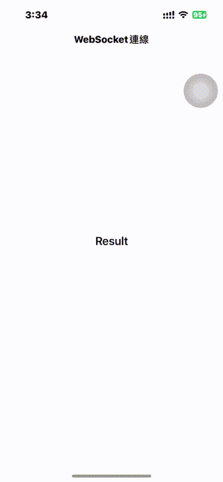

# WWWebSocket

[](https://developer.apple.com/swift/) [](https://developer.apple.com/swift/)  [](https://developer.apple.com/swift/) [](https://developer.apple.com/swift/)

### [Introduction - 簡介](https://swiftpackageindex.com/William-Weng)
- Wraps URLSession's iOS 13 webSocketTask() into an easy-to-use widget.
- 將URLSession的iOS 13的webSocketTask()包裝成簡單使用的小工具。



### [Installation with Swift Package Manager](https://medium.com/彼得潘的-swift-ios-app-開發問題解答集/使用-spm-安裝第三方套件-xcode-11-新功能-2c4ffcf85b4b)
```bash
dependencies: [
    .package(url: "https://github.com/William-Weng/WWWebSocket.git", .upToNextMajor(from: "1.1.1"))
]
```

### Function - 可用函式
|函式|功能|
|-|-|
|connent(with:delegate:configuration:delegateQueue:)|WebSocket連線 => 接收訊息|
|sendMessage(_:result:)|傳送訊息|
|cancel(with:reason:)|關閉連線|

### Example
```swift
import UIKit
import WWPrint
import WWWebSocket

final class ViewController: UIViewController {
    
    @IBOutlet weak var resultLabel: UILabel!
    
    private let url = "wss://demo.piesocket.com/v3/channel_123?api_key=VCXCEuvhGcBDP7XhiJJUDvR1e1D3eiVjgZ9VRiaV&notify_self"
    
    override func viewDidLoad() {
        super.viewDidLoad()
        connect(with: url)
    }
}

// MARK: - WWWebSocketDelegate
extension ViewController: WWWebSocketDelegate {
    
    func didOpenWithProtocol(_ protocol: String?) {
        wwPrint("connected => \(String(describing: `protocol`))")
    }
    
    func didCloseWith(_ closeCode: URLSessionWebSocketTask.CloseCode, reason: Data?) {
        wwPrint("disconnected => \(closeCode), \(String(describing: reason))")
    }
    
    func receiveMessageResult(_ result: Result<URLSessionWebSocketTask.Message, Error>) {
        
        switch result {
        case .failure(let error): wwPrint(error)
        case .success(let message):
            switch message {
            case .string(let string): self.resultLabel.text = string
            case .data(let data): wwPrint(data)
            @unknown default: break
            }
        }
    }
}

// MARK: - 小工具
private extension ViewController {
    
    /// [WebSocket連線](https://www.piesocket.com/websocket-tester)
    /// - Parameter url: String
    func connect(with url: String) {
        WWWebSocket.shared.connent(with: url, delegate: self)
    }
}
```
